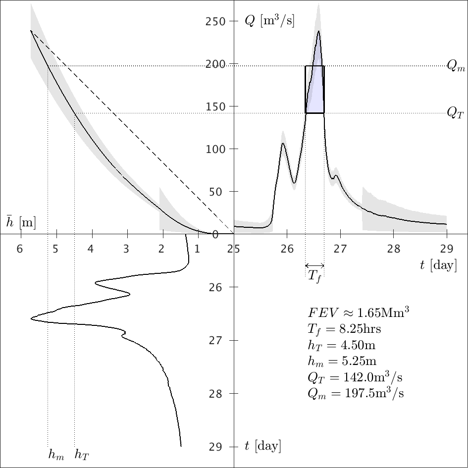
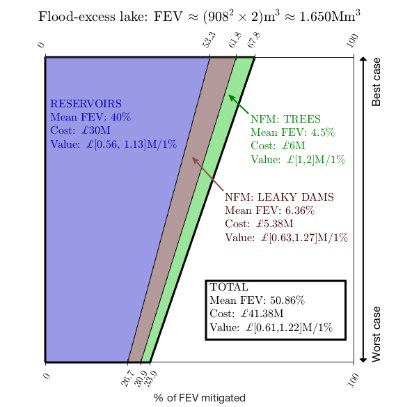

# RiverCalder


## FEV analysis for the Boxing day 2015 flood of the River Calder at Mytholmroyd

Work published as: 

Bokhove, O., Kelmanson, M.A., Kent. T., Piton, G. and Tacnet, J.-M. (2019): Communicating (nature-based) flood-mitigation schemes using flood-excess volume. *River Res. Applic.*, **35**, 1402-1414. [DOI](https://doi.org/10.1002/rra.3507).

*Above figure (credit JBA report 'Calder Catchment strategic flood risk assessment' Vol. I, 2016): the Calder catchment. Mytholmroyd lies just downstream of Hebden Bridge in Calderdale; the steep, narrow valley makes flood mitigation difficult.*

See also:
* 'Using flood-excess volume to assess and communicate flood-mitigation schemes': [presentation](http://www1.maths.leeds.ac.uk/~amttk/files/leedskyoto.pdf) and [poster](http://www1.maths.leeds.ac.uk/~amttk/files/INI_sept2018.pdf). 

### Graphical output 

#### Data analysis: from depth to discharge to FEV

From the ```/code``` dir, run: 
 * ```quadrantplot_calder.m``` 
 
The script completes the FEV analysis and calls four plotting routines:
 * ```plot3panelerr;```
 * ```plotFEVhT;```
 * ```plot_h_year;```
 * ```plot_ratingcurve;```
 
in total, seven figures are produced, including an adaptation of figure 3 below from Bokhove et al, 2019.



*Caption: Visualisation of 2015 flood data (River Calder) of (top‐left) the rating curve Q = Q(h) and its linear approximation; (bottom‐left) reoriented view of the river‐level time series, and (top‐right) discharge data, in which flood‐excess volume (FEV) is the shaded “area” between the discharge curve Q(t), displayed vertically as function of time t (day in December 2015) horizontally, and chosen threshold discharge Q_T = Q(h_T). It involves in situ temporal river level h = h(t). The rectangle (top‐right) represents a mean (approximation of the) FEV based on mean and threshold discharges and a flood duration T_f = 8.25hrs. Horizontal dashed lines indicate chosen threshold and mean levels and corresponding discharges, obtained graphically via the rating curve. Errors from the rating curve uncertainty are indicated by grey shading.*

#### Cost-effectiveness analysis

Run ```calderfloodlake.m``` to produce figure 7 in Bokhove et al, 2019:



*Caption: Graphical overview of flood‐excess volume (FEV) fraction captured by three flood‐mitigation measures and associated costs for the River Calder at Mytholmroyd. FEV ≈ 1.65 Mm3 is represented as a 2 m‐deep square lake of side‐length 908 m, illustrating the flood's magnitude, partitioned here by each measure. Overall flood mitigation ranges from 33.90% to 67.81% at a cost of £41.38 M. The mean of each measure is represented by corresponding quadrilateral areas, partitioning the overall square‐lake area with the same FEV‐capacity requiring mitigation. Sloping lines reflect the sliding scale between quoted ranges, owing to storage‐capacity uncertainty.*
